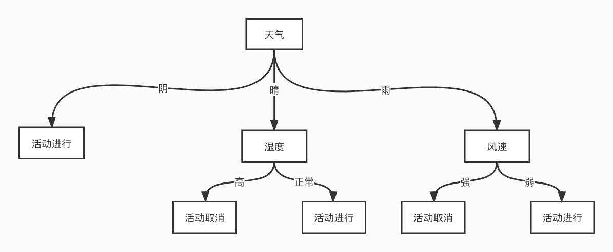

# x-decision-tree

> 一个简易决策树工具

**下面是一个决策案例**




1. 创建决策树
```java
private TreeNode buildDecisionTree() {

        return TreeNode.buildTreeNode("根节点", Arrays.asList(
                TreeNode.buildTreeNode("天气阴", Arrays.asList(
                        TreeNode.buildTreeNode("活动进行", "执行活动正常进行处理器")
                ), "weather == '阴'"),
                TreeNode.buildTreeNode("天气晴", Arrays.asList(
                        TreeNode.buildTreeNode("湿度高", Collections.singletonList(TreeNode.buildTreeNode("活动取消", "执行活动活动取消处理器")), "humidity == 'high'"),
                        TreeNode.buildTreeNode("湿度正常", Collections.singletonList(TreeNode.buildTreeNode("活动进行", "执行活动正常进行处理器")), "humidity == 'normal'")
                ), "weather == '晴'"),
                TreeNode.buildTreeNode("天气雨", Arrays.asList(
                        TreeNode.buildTreeNode("风速强", Collections.singletonList(TreeNode.buildTreeNode("活动取消", "执行活动活动取消处理器")), "windSpeed == 'strong'"),
                        TreeNode.buildTreeNode("风速弱", Collections.singletonList(TreeNode.buildTreeNode("活动进行", "执行活动正常进行处理器")), "windSpeed == 'weak'")
                ), "weather == '雨'")
        ), "");
    }
```
2. 生成决策树上下文
```java
   @Data
    public static class Context {
        private String weather;
        private String humidity;
        private String windSpeed;

        public Map<String, Object> buildMap() {

            Map<String, Object> map = new HashMap<>();
            map.put("weather", weather);
            map.put("humidity", humidity);
            map.put("windSpeed", windSpeed);
            return map;
        }

    }
```

3. 执行决策
```java
 Context context = new Context();
            context.setWeather("雨");
            context.setWindSpeed("weak");

            TreeNode treeNode = XDecisionTreeEngine.doDecision(buildDecisionTree(), context.buildMap(), UUID.randomUUID().toString());
            Assert.assertEquals("执行活动正常进行处理器", treeNode.getHandler());
```

 **com.x.decision.tree.XDecisionTreeApplicationTests 运行效果**
```java
[main] WARN com.x.decision.tree.XDecisionTreeEngine - id:[959ba39f-25c1-45ed-958f-541b5c944862] 决策路径:[根节点--->天气阴--->活动进行]
[main] WARN com.x.decision.tree.XDecisionTreeEngine - id:[2c50ea4e-a9b0-45a3-aff4-ddcefe867833] 决策路径:[根节点--->天气晴--->湿度高--->活动取消]
[main] WARN com.x.decision.tree.XDecisionTreeEngine - id:[2a7c1746-1270-4ec3-a8f0-540a1523d34a] 决策路径:[根节点--->天气晴--->湿度正常--->活动进行]
[main] WARN com.x.decision.tree.XDecisionTreeEngine - id:[b2500251-c754-40bb-ab68-b258facbe48e] 决策路径:[根节点--->天气雨--->风速强--->活动取消]
[main] WARN com.x.decision.tree.XDecisionTreeEngine - id:[0dc79656-4c62-49bd-bc4a-442ee513344f] 决策路径:[根节点--->天气雨--->风速弱--->活动进行]
```
